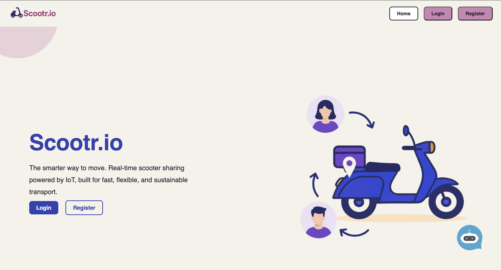
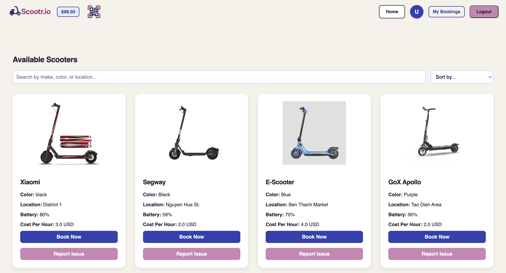
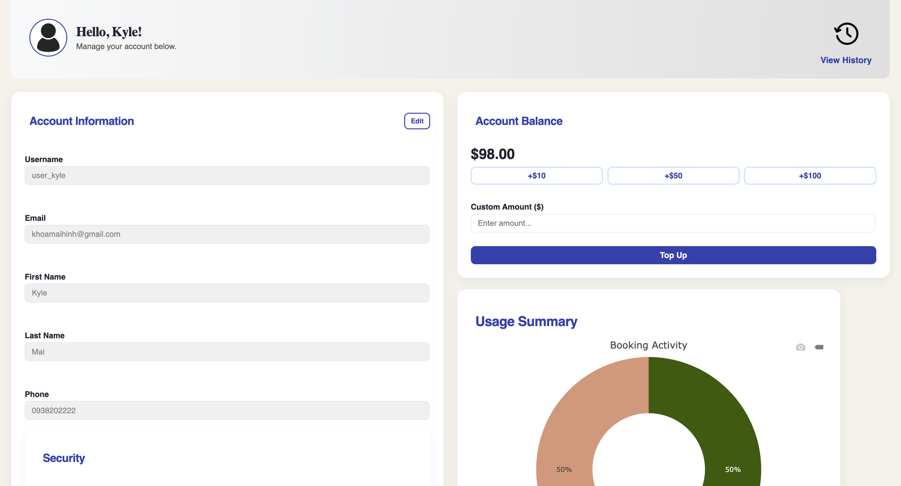
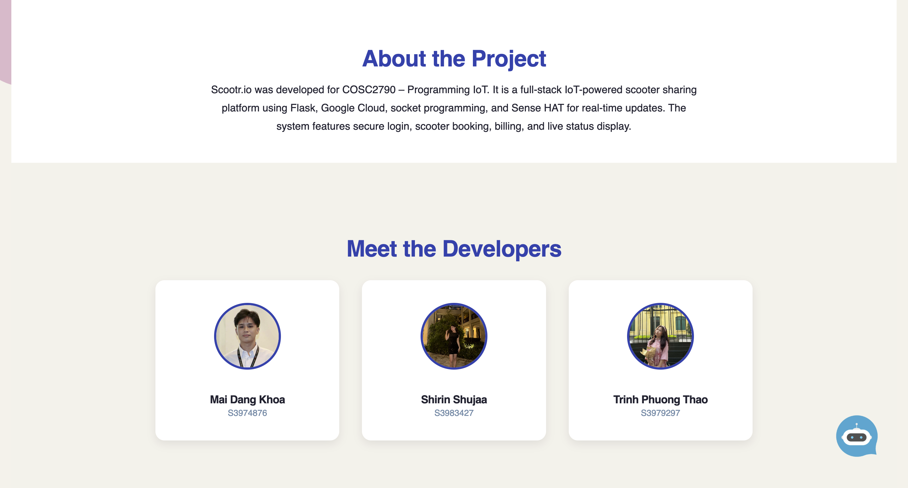

# Scootr.io - Raspberry Pi IoT Application

A distributed IoT application built with Raspberry Pi devices for smart scooter management and monitoring.

## 📸 Project Photos

_Add your project photos here_


_Caption: Welcome page with ChatBot dialog_


_Caption: Home page with available scooter_


_Caption: Profile page let user to top-up and edit their profile_


_Caption: Contribution_

## ▶️ Project Demo Video

## [Youtube](https://www.youtube.com/watch?v=pwnSwjbeF80)

## 🏗️ Architecture

This project uses a distributed architecture with two main components:

- **AgentPi**: Hosts the frontend web interface and handles user interactions
- **MasterPi**: Manages the backend services, database connections, and IoT device communications

## ✨ Features

### Core Functionality

- 🛴 **Real-time Scooter Tracking**: Monitor scooter locations and status in real-time
- 📍 **GPS Integration**: Google Maps integration for location services
- 💳 **Payment Processing**: Stripe integration for secure payments
- 📧 **Email Notifications**: Automated email alerts and confirmations
- 📊 **Data Analytics**: Comprehensive dashboard with usage statistics
- 🔐 **User Authentication**: Secure user registration and login system
- 🤖ིྀ **AI chatbot**: AI chatbot to help customer through the process
- 📅 **Calendar Setup**: Automatically create a calendar event using Google Calendar API
- 🔲 **QR scanning**: QR scanning to unlock/lock scooter

### IoT Capabilities

- 📡 **Sensor Monitoring**: Real-time data collection from IoT sensors
- 🔋 **Battery Management**: Monitor and report device battery levels
- 🌐 **Remote Control**: Control scooters remotely through the web interface
- 📱 **Mobile Responsive**: Optimized for mobile and desktop devices

### Technical Features

- 🐍 **Python Backend**: Flask-based
- 🚀 **Websocket Communication**: Raspberry Pi Websocket
- 🎨 **Modern Frontend**: Responsive web interface
- 🗄️ **Database Integration**: MySQL database for data persistence
- 🔧 **Modular Design**: Scalable microservices architecture

---

## 🚀 Getting Started

### Prerequisites

- 2x Raspberry Pi (3B+ or 4 recommended)
- MicroSD cards (32GB recommended)
- Internet connection
- Python 3.7+

### Installation

1. **Clone the repository:**

   ```bash
   git clone https://github.com/Kyle8Bits/Scootr.io_RaspberryPi_IoT.git
   cd Scootr.io_RaspberryPi_IoT
   ```

2. **Install dependencies:**

   ```bash
   pip install -r requirements.txt
   ```

3. **Configure environment variables** (see Environment Setup below)

4. **Run AgentPi (Frontend):**

   ```bash
   cd webpage
   python app.py
   ```

5. **Run MasterPi (Backend):**
   ```bash
   python -m master_pi.mai
   ```

---

## ⚙️ Environment Setup

Create a `.env` file in both the `agent_pi` and `master_pi` directories with the following configuration:

### Required Environment Variables

```bash
# Database Configuration
DB_IP="your.database.ip.here"
DB_USER="your_db_username"
DB_PASS="your_db_password"
DB_NAME="your_database_name"

# Email Service Configuration
MAIL_SERVER="smtp.gmail.com"
MAIL_PORT=587
MAIL_USE_TLS=True
MAIL_USERNAME="your_email@gmail.com"
MAIL_PASSWORD="your_app_specific_password"
MAIL_DEFAULT_SENDER="your_email@gmail.com"

# Google Maps API
GOOGLE_MAPS_API_KEY="your_google_maps_api_key"

# Stripe Payment Processing
STRIPE_API_KEY="your_stripe_secret_key"
```

### Setting Up Your Environment

1. **Database Setup:**

   - Set up a MySQL database
   - Replace `DB_IP`, `DB_USER`, `DB_PASS`, and `DB_NAME` with your database credentials

2. **Email Configuration:**

   - Use Gmail SMTP or your preferred email service
   - For Gmail, enable 2-factor authentication and generate an app-specific password
   - Replace `MAIL_USERNAME` and `MAIL_PASSWORD` with your credentials

3. **Google Maps API:**

   - Create a project in [Google Cloud Console](https://console.cloud.google.com/)
   - Enable the Maps JavaScript API
   - Generate an API key and replace `GOOGLE_MAPS_API_KEY`

4. **Stripe Setup:**
   - Create a [Stripe account](https://stripe.com/)
   - Get your test API key from the Stripe dashboard
   - Replace `STRIPE_API_KEY` with your key (use test keys for development)

### Add credentials.json for Google Calendar

1. **Google Calendar credential**
   - Get the credentials.json from Google Calendar API [https://developers.google.com/workspace/calendar/api/guides/overview]
   - Place the json file into `master_pi/database` directory
   - Run the `load_credentials()` in the [google_calendar.py](master_pi/database/google_calendar.py)

### Security Notes

- ⚠️ **Never commit the `.env` file to version control**
- 🔒 **Keep your API keys and passwords secure**
- 🧪 **Use test keys during development**
- 🔐 **Regenerate keys if accidentally exposed**

---

## 🛠️ Usage

1. Access the web interface at `http://[AgentPi_IP]:5000`
2. Register a new account or login with existing credentials
3. View real-time scooter data on the dashboard
4. Use the map interface to locate available scooters
5. Process payments through the integrated Stripe checkout

---

## 📁 Project Structure

```
Scootr.io_RaspberryPi_IoT/
├── agent_pi/          # Frontend application
│   ├── templates/     # HTML templates
│   ├── static/        # CSS, JS, images
│   └── app.py         # Flask frontend app
├── master_pi/         # Backend application
│   ├── routes/        # API routes
│   ├── models/        # Database models
│   └── app.py         # Flask backend app
├── database/          # Database schemas
├── docs/              # Documentation
└── README.md
```

---

## 🤝 Contributing

1. Fork the repository
2. Create a feature branch (`git checkout -b feature/AmazingFeature`)
3. Commit your changes (`git commit -m 'Add some AmazingFeature'`)
4. Push to the branch (`git push origin feature/AmazingFeature`)
5. Open a Pull Request

---

## 📄 License

This project is licensed under the MIT License - see the [LICENSE](LICENSE) file for details.

---

## 📞 Support

If you encounter any issues or have questions:

- Open an issue on GitHub
- Contact the development team
- Check the documentation in the `docs/` folder

---

_Built with ❤️ for IoT enthusiasts and Raspberry Pi developers_
